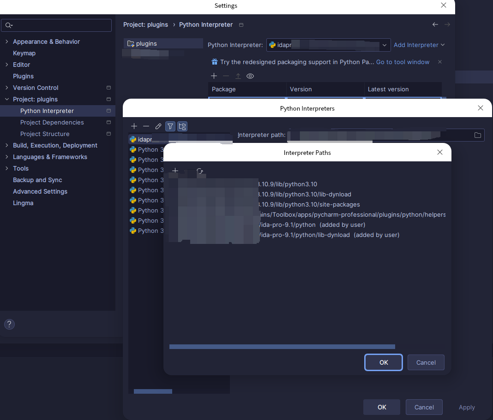
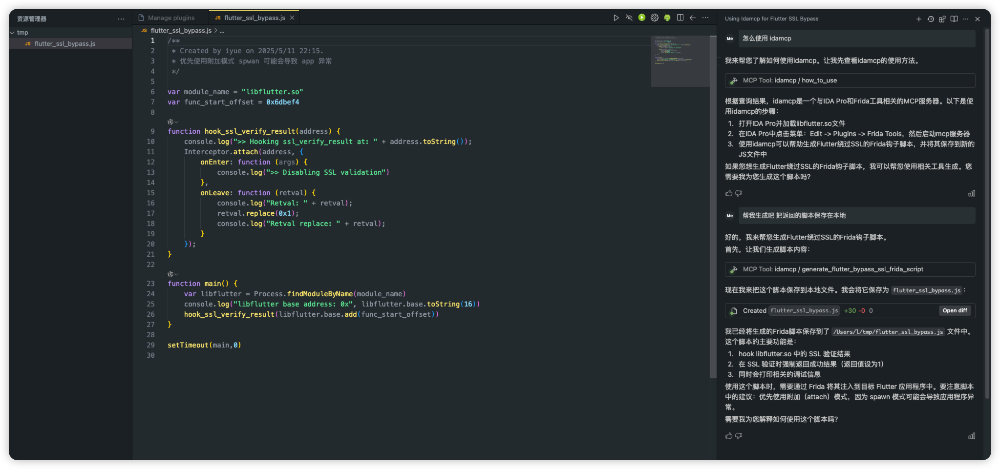

English | [简体中文](README-zh-CN.md)

# Project Description

*   This is a plug-in script based on `IDA Pro 9.1` , which can generate `js` code of `frida hook` function in one click in the assembly window

# How to use

*   Simply press the shortcut key `F` in the assembly window to generate the `hook` code for the function where the current pointer is located.

```shell
uv init
uv sync
pip install "mcp[cli]"
```
```json
{
    "mcpServers": {
        "idamcp": {
            // windsurf 
            "serverUrl": "http://127.0.0.1:12345/sse",
            // cursor 
            // "url": "http://127.0.0.1:12345/sse",
        }
    }
}
```

## Linux & Mac

```shell
rm -rf $HOME/.idapro/plugins/frida && git clone https://github.com/ys1231/idafridascript.git $HOME/.idapro/plugins/frida
```

## List of features

1. Generate the hook code for the function
2. Generate code for the Flutter SSL Bypass Frida Hook
3. Add a base mcp server, which can be used in IDA Pro to generate Flutter bypass hook scripts


# How to continue development

1. After using the `clone` project, open the project with `Pycharm` and add `IDA Pro` plug-in development environment





